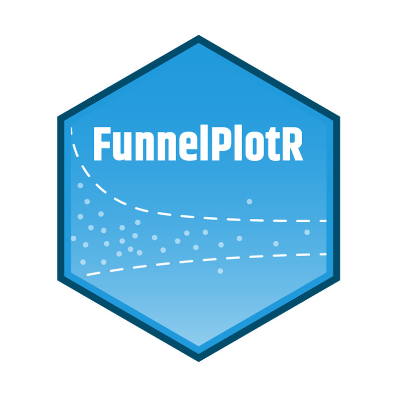

class: title-slide

```{r setup, include=FALSE}
options(htmltools.dir.version = FALSE)
knitr::opts_chunk$set(
  fig.height=6
  , fig.width=10
  , fig.align = "center"
	, dev.args = list(png = list(type = "cairo"))
)
 
library(Cairo)
library(showtext)
library(ggplot2)

theme_set(
  theme_minimal()+
  theme(text = element_text(family = "opensans"))
)


```

<br><br><br>

# Data Science on a budget

<br><br>

.pull-left[
__Chris Mainey__
<b><p style="font-size:26;">Senior Data Scientist<br>
University Hospitals Birmingham <br>
NHS Foundation Trust</b></p>
<br>
<span style="font-size:26;">[chris.mainey@uhb.nhs.uk](mailto:chris.mainey@uhb.nhs.uk)</span><br>
`r icon::fa("twitter", color=rgb(148, 198, 0, maxColorValue = 255))` <a href="https://twitter.com/chrismainey?s=09" style="line-height:2;">@chrismainey</a>
]

.pull-right[

<br>

<br>


]

---

# NHS Overview


.pull-left[
__UK's large, public-funded, healthcare system__

+ Primary (GP), secondary (hospitals), tertiary (regional), community and mental health services.
+ Although there's much co-operation, network of separate, competing, organisations
{{content}}

]

.pull-right[
<br><br>
<p align="center" style="vertical-align:middle">

</p>

<br>
<span style="font-size:10px">Image: Aintree Hospitals: https://www.aintreehospital.nhs.uk/news-events/?page=41&media=3098</span>
]

--

<br>
__Data Science work can be found in lots of areas:__
+ Trust BI and information teams
+ Finance and planning teams
+ Clinical research, sometimes in partnership
+ Clinical sciences, e.g. imaging, genomic
+ Interested individuals


---

# Univesity Hospitals Birmingham NHS FT

<p align="center">

</p>

.pull-left[
+ One of the largest Trust's in UK
+ QE, Heartlands, Good Hope, Solihull
+ Regional specialist services center
+ Strong clinical research, partnerships with HDR-UK, Turing Institute, Microsoft etc.
]

--

.pull-right[
+ Large, merged, informatics department
+ SQL Server-based analysis and dashboards, .
+ Spotfire, .NET websites, with bits of R, Stata, SAS, PowerBI and D3.
+ Funding is tight and hard to justify new projects.
]


---

# Healthcare Evaluation Data (HED)


<a href="https://www.hed.nhs.uk">www.hed.nhs.uk </a>


.pull-left[
- Online hospital benchmarking system
- Statistical models and analysis tools
- Activity, Mortality, Re-admissions, Length-of-Stay, Market-share etc.
- Built by Informatics team at University Hospitals Birmingham NHS Foundation Trust
- Used by ~60 NHS and other organisations
- Training and support, including `R`
<br><br>
- __Using national NHS data, including HES, ONS mortality, central returns, NRLS and others__
]
.pull-right[
<br>

]


---

# What is our work like?

+ Building models on national hospital data, mortality, readmissions, LOS etc.

--

+ Not 'big data', but large, relational data (~60 million pa, 100+ data items)

--

+ We had used SAS for many years, but it's expensive.

--

+ I had PhD work funded, and chose to use `R`, led to devleoping new methods.

--

+ Working to 'productions' our modelling process in `R`, improve automation etc.

--

+ Adopted tools like Git and building R packages, looking at Docker etc., but not 'supported.'

--

+ I have to justify increase in profit, or saving on time spent to frame what we do.

--

+ I run R training courses and R-usergroup to promote it.
---

# Set up

+ Bog-standard Windows desktop.

--

+ Fight for more RAM, although over charged!

--

+ Important to note, cloud providers are not yet fully trusted.

--

+ Desktop machines are constrained in RAM, disk and CPU, so we learnt to be efficient.

--

+ Couldn't get funding for RStudio professional or other solutions, so eventually set up our own.

--

+ Acquired a piece of a 'development' server and put Linux VM on it, now run Open Source RStudio server.

--

+ Again, not supported by our Trust, but we have to manage locally.


---

# Take aways

+ There is plenty of Data Science in the NHS!

+ You often have to fight for it.

+ Need to sell the benefits to anyone who might be able to fund.

+ Even without funding, there is loads you can do.

+ Demonstrate benefits and take people along with you to make your case!

+ Engage with the community, e.g. NHS-R community, Twitter, third sector

+ Be an Evangelist!  Train others, publish blogs/articles, be a mentor.

---

class: middle

# Thanks for your time!

.pull-left[
`r icon::fa("envelope", color=rgb(148, 198, 0, maxColorValue = 255))` <a href="mailto:chris.mainey@uhb.nhs.uk;" style="line-height:2;"> chris.mainey@uhb.nhs.uk </a>
<br>
`r icon::fa("globe", color=rgb(148, 198, 0, maxColorValue = 255))` <a href="http://www.hed.nhs.uk" style="line-height:2;">http://www.hed.nhs.uk</a>
<br>
`r icon::fa("twitter", color=rgb(148, 198, 0, maxColorValue = 255))` <a href="https://twitter.com/chrismainey?s=09" style="line-height:2;">@chrismainey</a>
<br>
`r icon::fa("github", color=rgb(148, 198, 0, maxColorValue = 255))` <a href="https://github.com/chrismainey)" style="line-height:2;">chrismainey</a>
<br>
`r icon::fa("globe", color=rgb(148, 198, 0, maxColorValue = 255))` <a href="http://www.mainard.co.uk" style="line-height:2;">http://www.mainard.co.uk</a>
<br>
`r icon::fa("globe", color=rgb(148, 198, 0, maxColorValue = 255))` <a href="https://nhsrcommunity.com/" style="line-height:2;">https://nhsrcommunity.com/</a>


<br>
<br>
 `FunnelPlotR`  `r icon::fa("box", color=rgb(148, 198, 0, maxColorValue = 255))`  now available on CRAN!
]

.pull-right[
 
]